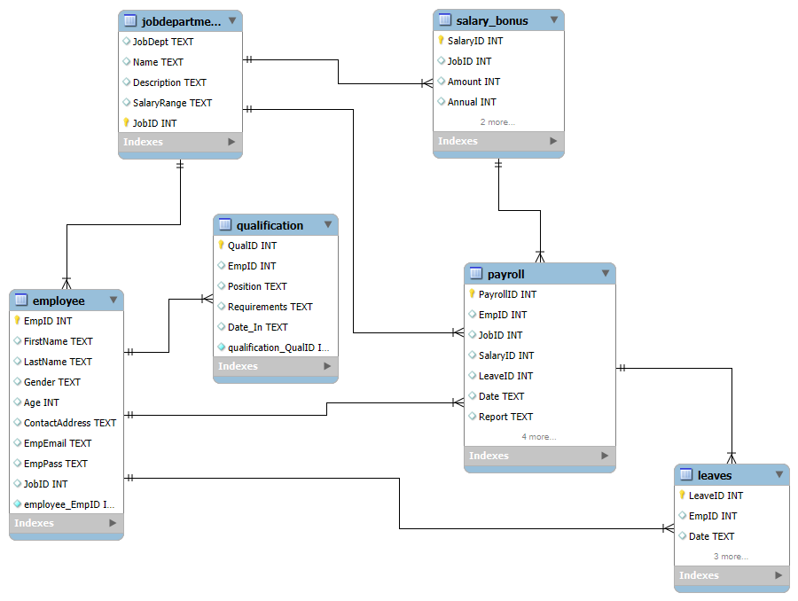

# Employee Payroll Management System using MySQL

A relational database project developed using **MySQL** to manage employee information, departments, payroll, salary, qualifications, and leave records. This project demonstrates SQL development skills including database design, advanced SQL queries, views, stored procedures, indexing, CTEs, window functions, and data analysis.

---

## Project Overview

The Employee Payroll Management System is designed to manage and analyze employee payroll data efficiently. The database follows relational database principles with normalized tables connected using primary and foreign keys.

The project includes business-oriented SQL queries to answer real-world payroll and employee management questions.

---

## Features

- Employee Management
- Department Management
- Payroll Processing
- Salary & Bonus Management
- Leave Management
- Employee Qualification Tracking
- Business Data Analysis
- Data Cleaning Queries
- Performance Optimization using Indexes

---

## Database Schema

The database consists of the following tables:

| Table | Description |
|--------|-------------|
| Employee | Stores employee information |
| JobDepartment | Stores department and job details |
| Payroll | Employee payroll records |
| Salary_Bonus | Salary and bonus information |
| Qualification | Employee qualification details |
| Leaves | Employee leave records |

---

## ER Diagram

<p align="center">

</p>

---

## SQL Concepts Used

### Basic SQL

- SELECT
- WHERE
- ORDER BY
- GROUP BY
- HAVING
- LIMIT
- DISTINCT

### Joins

- INNER JOIN
- Multiple Table JOINs

### Aggregate Functions

- COUNT()
- SUM()
- AVG()
- MAX()
- MIN()

### Advanced SQL

- Common Table Expressions (CTEs)
- Window Functions (RANK())
- Subqueries
- Views
- Stored Procedures
- Indexes

### Data Cleaning

- REPLACE()
- SUBSTRING_INDEX()
- Duplicate Detection

---

## Business Problems Solved

- Total employees in each department
- Department-wise salary analysis
- Employee payroll reports
- Highest paid employees
- Average salary by department
- Employees with maximum leave
- Annual salary calculations
- Employee qualification analysis
- Duplicate record detection
- Payroll summary reports

---

## Technologies Used

- MySQL
- MySQL Workbench

---

## Project Structure

```
Employee_Payroll_Management_System/
│
├── employee_Management.sql
├── Employee.csv
├── JobDepartment.csv
├── Payroll.csv
├── Salary_Bonus.csv
├── Qualification.csv
├── Leaves.csv
├── ER-Diagram.png
└── README.md
```

---

## Sample SQL Topics Covered

- Database Creation
- Table Creation
- Primary Keys
- Foreign Keys
- Constraints
- Joins
- Aggregate Functions
- GROUP BY
- HAVING
- CTEs
- Window Functions
- Subqueries
- Views
- Stored Procedures
- Indexing
- Data Cleaning
- Business Analysis Queries

---

## Learning Outcomes

Through this project, I gained practical experience in:

- Relational Database Design
- Database Normalization
- Writing Complex SQL Queries
- Query Optimization
- Data Cleaning
- Payroll Data Analysis
- Business Reporting
- SQL Performance Optimization

---

## Future Improvements

- Add Triggers
- Add Transactions
- Add User Authentication
- Develop a Python GUI
- Integrate with Power BI Dashboard
- Deploy using MySQL Server

---

## Author

**Shiva Pagidimarri**

- GitHub: https://github.com/PagidimarriShiva
- LinkedIn: https://www.linkedin.com/in/shiva-pagidimarri/

---

## License

This project is intended for learning, portfolio, and educational purposes.
